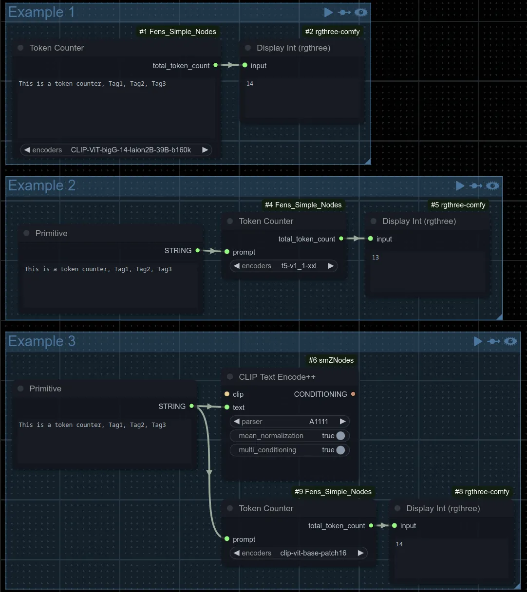

# Fen's Simple Nodes

This provides very simple nodes.

> [!NOTE]
> This projected was created to learn how to program ComfyUI nodes. So far this includes a single node with the plan to eventually add more.

## Quickstart

1. Install [ComfyUI](https://docs.comfy.org/get_started).
1. Install [ComfyUI-Manager](https://github.com/ltdrdata/ComfyUI-Manager)
1. Look up this extension in ComfyUI-Manager. If you are installing manually, clone this repository under `ComfyUI/custom_nodes`.
1. Restart ComfyUI.

# Features

- A simple token counter with the ability to change encoders.

# Examples

### Token Counter

